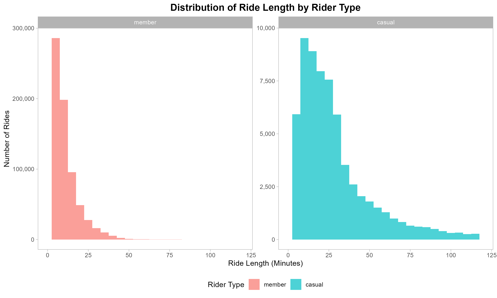
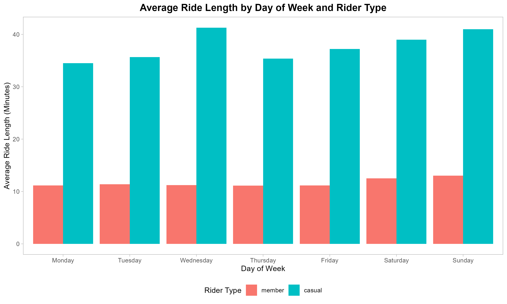
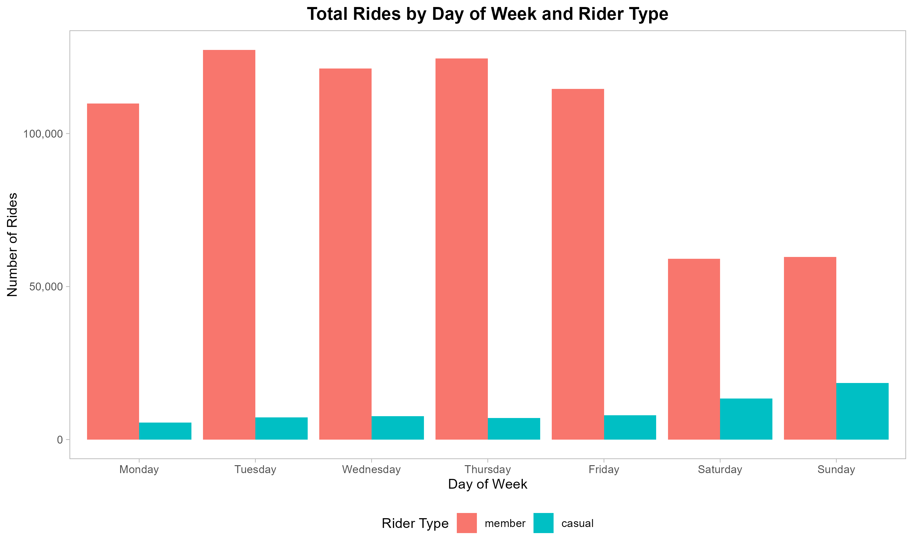

## 1. Problem Statement & Business Task

**Business Task:**
Analyze historical trip data to identify differences in how casual riders and annual members use Cyclistic bikes. The goal is to inform a new marketing strategy to convert casual riders into annual members.

**Stakeholders:**
* **Lily Moreno:** Director of Marketing
* **Cyclistic Executive Team:** Decision-makers who will approve the recommendations

## 2. Data Sources and Preparation

**Dataset:**
This analysis uses a public dataset provided by Motivate International Inc., which is a great proxy for Cyclistic's data. It includes Divvy trip data from the first quarters (January-March) of 2019 and 2020. The data is publicly available on the Divvy Bikes website.

**Data Integrity (ROCCC):**
The dataset was evaluated for its integrity using the ROCCC framework:
* **Reliable:** The data is from a reputable source (Divvy).
* **Original:** The data is directly from the source and is not a secondary source.
* **Comprehensive:** The dataset contains detailed information on ride length, station names, and user types.
* **Current:** The data is a historical snapshot, which is appropriate for this analysis.
* **Cited:** The data is cited as "Divvy Trip Data."

## 3. Data Processing and Cleaning

**Tools Used:**
The analysis was performed using R, with the following key libraries: `tidyverse`, `lubridate`, `scales`, and `janitor`.

**Cleaning Steps:**
* Combined the 2019 and 2020 Q1 datasets into a single data frame.
* Standardized column names for consistency.
* Removed rows with missing values in critical columns.
* Created new columns for `ride_length` (in minutes), `day_of_week`, and `month`.
* Filtered out invalid ride durations (e.g., less than 1 minute).

## 4. Analysis and Key Findings

**Key Insights:**
* **Ride Length:** Casual riders have an average ride length of **38.5 minutes**, significantly longer than members, who average **11.5 minutes**.
* **Weekly Usage:** Members show a typical weekday commuter pattern, with peak usage from Tuesday to Thursday. Casual riders, on the other hand, show peak usage on weekends, suggesting leisure-oriented trips.
* **Time of Day:** Members use the bikes most during morning and evening rush hours, while casual riders have a broader peak in the afternoon.

## 5. Key Visualizations and Insights

Here are some of the key visualizations that support the findings.

### Ride Length Distribution

_This histogram shows the distribution of ride lengths for both casual riders and members._

### Average Ride Length by Day of Week

_This chart shows that casual riders consistently have longer average ride times than members, especially on weekends._

### Total Rides by Day of Week

_This visualization highlights the commuter pattern for members (peak on weekdays) and the leisure pattern for casual riders (peak on weekends)._

## 6. Recommendations

Based on the analysis, here are the top three recommendations to convert casual riders into annual members.

1.  **Weekend Membership Plan:** Introduce a specialized, lower-cost membership plan for weekend use, targeting the casual riders who use bikes for longer, recreational trips on Saturdays and Sundays.
2.  **Commuter Incentives:** Launch a targeted marketing campaign near popular transit hubs, offering a one-month free trial or a discount on annual memberships to attract casual riders who are already commuting.
3.  **Seasonal Promotions:** Offer promotions during the spring and early summer (March-April) when ridership begins to increase, leveraging the seasonal trend to convert more casual riders into members.

**Next Steps:**
* Analyze a full year of data to understand seasonal trends more deeply.
* Conduct surveys with casual riders to better understand their motivations and barriers to purchasing a membership.

## 7. Code & Final Report

You can view the full R Markdown script for this analysis here:
[cyclistic_analysis.Rmd](code/cyclistic_analysis.Rmd)

The final reports, knit from the R Markdown file, can be found here:
* [Final Report (PDF)](outputs/cyclistic_case_study.pdf)
* [Final Report (HTML)](outputs/cyclistic_case_study.html)

## 8. About Me

My name is Asegid Ayele, and I am a data analyst with a passion for using data to solve business problems. This project is a demonstration of my skills in data cleaning, exploratory analysis, and communicating data-driven recommendations.

* **LinkedIn:** [https://www.linkedin.com/in/asegid-ayele-74526a1aa?utm_source=share&utm_campaign=share_via&utm_content=profile&utm_medium=android_app]
* **Email:** [abem646@gmail.com]

